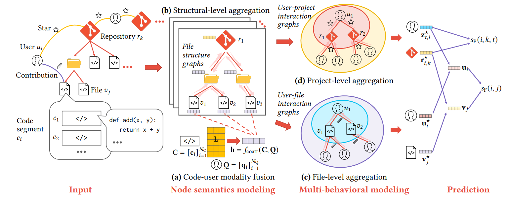

# CODER

This is the official implementation of the paper ([“Code Recommendation for Open Source Software Developers”](https://arxiv.org/abs/2210.08332))  published at The Web Conference 2023 (WWW 2023).

Please kindly cite our paper if you use our code or dataset in your research:

```angular2html
@article{jin2022code,
  title={Code Recommendation for Open Source Software Developers},
  author={Jin, Yiqiao and Bai, Yunsheng and Zhu, Yanqiao and Sun, Yizhou and Wang, Wei},
  journal={arXiv preprint arXiv:2210.08332},
  year={2022}
}
```



## Updates

[April 29th, 2023]: We have release the dataset. The code is under restructuring. Please stay tuned!

## What’s New 

Compared to the original implementation in our paper, we have made the following improvements:

* **Support for multiple branches**: In the previous version, we only considered commits on the default branch. This updated version incorporates commits across multiple branches for each repository
* **Expanded repository dataset**: The original code included 300 repositories per dataset, while this updated version contains a significantly larger number of repositories.
* **Additional interaction types**: Our paper used GitHub stars and contributions as user-repository interactions. In the provided data, we now include subscribers, watchers, and forks as additional interaction types.
* **Improved file matching**: We have made the file matching more accurate in this implementation. In the earlier version, tracking files that were renamed during development was challenging. In this updated version, we have improved tracking by chasing the files through their HEXSHA.


## Dataset

### Processed data

We will upload the processed data soon.

### Raw dataset

The raw dataset is available at ([Google Drive](https://drive.google.com/drive/folders/1-dehBnSc9kBcEKwL9SroEqNMVoLOvU1F?usp=share_link)). It includes 5 files: `stargazers.tar.gz`, `stargazers_2023.tar.gz`, `watchers.tar.gz`, `subscribers.tar.gz`, and `forks.tar.gz`.

untar each file using commands like:

```
tar -xzf forks.tar.gz
```

Each file is organized as `FEATURE_NAME/REPOSITORY_OWNER/REPOSITORY_NAME/FEATURE_NAME.json`


e.g.

* `watchers/huggingface/transformers/watchers.json`
* `stargazers/huggingface/transformers/stargazers.json`

Note:

* `watchers.tar.gz`, `subscribers.tar.gz`, and `forks.tar.gz`includes all events up to April 2023.
* `stargazers.tar.gz` includes all events up to February 2022, which was used in our original dataset. For the newest stargazers, we have crawled an extra file `stargazers_2023.tar.gz` which includes all starring events up to April 2023.
* For contributors, we can directly use the commit history of each repository.


* **Stargazers** are users who have starred a particular GitHub repository. Starring a repository is similar to bookmarking it or adding it to your favorites list. It's a way to keep track of repositories that you find interesting or useful. Stargazers receive notifications when the repository is updated or when new issues are created.

* **Forks**: Forking a repository creates a copy of the repository that is entirely separate from the original. Forking is useful for creating your own version of someone else's project or for experimenting with new features without affecting the original project. When you fork a repository, you become the owner of the new repository, and you can make changes to it as you see fit.

* **Watchers**: Watchers are users who have opted to receive notifications when a particular GitHub repository is updated. Watching a repository is similar to starring it, but it's more focused on the activity within the repository itself rather than the repository as a whole. Watchers receive notifications when new commits are made, issues are opened or closed, or pull requests are created.

* **Subscribers**: Subscribers are users who have opted to receive notifications when a particular GitHub repository is updated, but they are more interested in the big picture of the repository rather than the specific activity within it. Subscribers receive notifications when new releases are made, when the repository is forked or when someone stars it, and when people contribute to the repository in any way.


### Clone the repositories

Run `pip install gitpython` to install the gitpython package.  Retrieve individual GitHub repositories using `python dataset/download_repositories.py`. Note: please run this script using `CODER/` as the current working directory.

## Notes

### Git author vs committer

In Git, the author and committer of a commit represent two different roles with distinct meanings:

* **Author**: The person who originally wrote the code being committed. Git records the author of the commit as the person who made the changes.
* **Committer**: The person who runs the git commit command to create the commit object. This may or may not be the same person as the author of the changes being committed.

In our code, we recommend files to authors of previous commits.


Thus, the actual person who writes the code is the author of the commit. The committer is the person who performs the action of committing the changes to the Git repository. 

In our code, we use recommend files to **authors** of previous commits.


### Git/GitHub user identifier

Git and GitHub use two different types of user identifiers:

* **Git**: Uses the email and name of each commit author.
* **GitHub**: Uses user logins (e.g., the "Ahren09" part of https://github.com/Ahren09).

When collecting stargazers, forks, subscribers, and watchers data from GitHub, we only obtain user logins. On the other hand, the commit history of each GitHub repository provides both user logins and user emails. We then match these logins (GitHub's user identifiers) with users' emails (Git's user identifiers) through the commit history of each repository.

## Limitation

* Currently, CODER does not handle this dynamic graphs. This is because an OSS project typically contains multiple branches. Thus, a multi-branch repository can be in multiple states at any given timestamp, making it difficult to model the repository as a dynamic graph. It would be interesting to study this multi-state nature of OSS projects in the future.

## Acknowledgement
Some of the implementations are from [LightGCN (PyTorch)](https://github.com/gusye1234/LightGCN-PyTorch.git)

